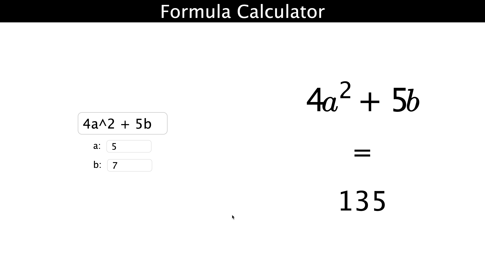
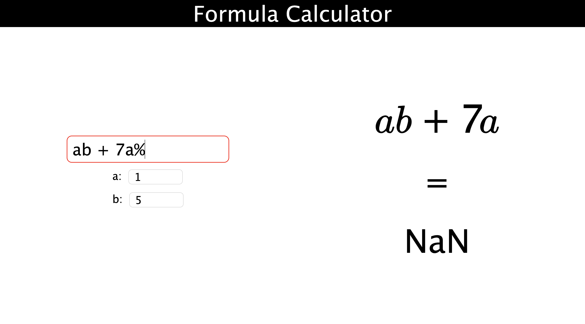

# Calculator

### Tools:

-   React
-   Webpack
-   MathJax (for latex compilation)
-   TypeScript

### Features:

-   Supports basic arithematic operations like addition, subtraction, division, multiplication and exponentiation.
-   Supports variable assignment (Max limit: 52)
-   Supports the use of parenthesis.
-   Shows error state on the input dialog if the math expression is invalid.
-   Displays the same math expression in latex.
-   Understands implicit multiplication on concatenating operands without operator (Example: 4a + b ==> 4 \* a + b)
-   Real time results

 

|

|
